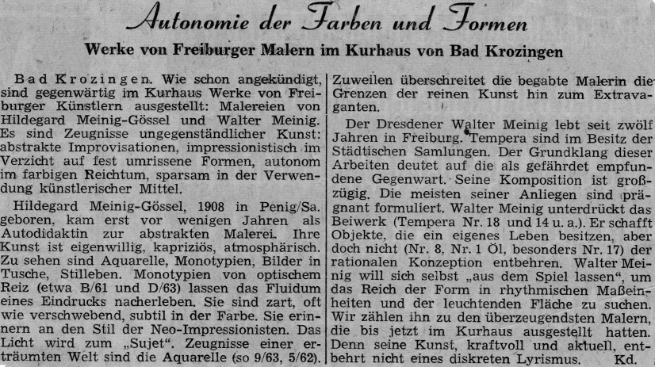

Walther Meinig war nicht auf eine spezifische Stilrichtung oder Gattung festgelegt. Einer seinen Hauptschwerpunkte war sicher die Landschaftsmalerei, wobei hier wiederum Berglandschaften, insbesondere in Südtirol und im Schwarzwald, einen Schwerpunkt bilden.

Darüber hinaus porträtierte er auch Personen und Tiere. Schließlich finden sich zahlreiche Stillleben und auch abstrakte Gemälde unter seinen Werken.
Bei den Maltechniken verwendet er im Wesentlichen Öl, Tempera und Aquarellmalerei.

Die Badische Zeitung kommt in einem Artikel über ihn zu folgender Einschätzung:

